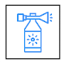

# Instructions

The In My Voice app is available through the App Store[\*\*](./index.md#acknowledgements) on both iOS and macOS.

## Quick Start ##

On your Apple device (iOS or macOS), follow these steps:

1. Install In My Voice from the App Store.
2. Launch In My Voice on your device.
3. (Optional) Configure your desired Apple and/or Eleven Labs speech settings.
4. Hit the **Speak** button and start typing. Your typed words will be vocalized whenever you hit the return key.

## Home Screen

The home screen of the In My Voice app, shown whenever you launch the app or leave a conversation, is what gives you access to all of the app’s functionality.  On the home screen, you will find the following controls:

- **Speak** — Tap this button to open the [Speech Window](#speech-window). You can immediately start typing. Your typed words will be vocalized whenever you hit the return key.
- **Edit Favorites** — Tapping this button opens an [Edit Favorites window](#edit-favorites) that allows you to create and edit favorite phrases for use while speaking. Instructions for using favorites in conversations can be [found below](#favorites).
- **Speech Settings** — Tap this button to open the [Speech Settings window](#speech-settings) where you can configure the voices used by Apple and ElevenLabs to vocalize your typed text.
- **App Settings** — On an iPhone or iPad, this takes you to the In My Voice settings in your Settings app.  On a Mac, this opens an In My Voice settings window.  All the possible settings are [described below](#app-settings).
- **Data Collection and Privacy** — Tap this link to open the [Data Collection and Privacy window](#data-collection-and-privacy), where you can sign up to participate in a research study.
- **How To Use** — Tap this button to open the [instructions page](./instructions.html) you are reading right now.
- **About** — Tap this button to open the In My Voice app [information page](./index.html).
- **Support** — Tap this button to open the In My Voice app [support page](./support.html). In addition to an FAQ, this page provides a way to contact the In My Voice development team.
- **Larger Type** — This switch allows you to use larger type throughout the app.
- **Version Number** — At the very bottom of the home screen in small type is the app’s version number, such as “v1.0.3”.  This is not a control. It’s information that you should include if you ever have occasion to fill out a [support request form](https://forms.gle/GE9BjX6MPMi8kTkFA).

## Speech Window

Hitting the Speak button puts you into the Speech window, which has three parts, arranged top to bottom:

* The [Speech Controls](#speech-controls) view.
* The [Past Text](#past-text) view.
* The [Live Text](#live-text) view.

### Speech Controls ###

The Speech Controls view is an array of buttons and switches, arranged from left to right across the top of the Speech window. Some perform actions, while others determine the overall behavior of the app while you are speaking.  Whenever you finish a session, the app remembers the state of these controls for your next session.

* **Alert** — Tapping this button makes a noise on your device meant to draw your listeners’ attention. By default, the button looks like  and the sound is a bicycle horn. But if you long press the button, it will show a menu offering two other choices: an air horn  and a bicycle bell . Your choice is used until the next long-press.

* **Typing Sounds** — This button (shown as  when on and  when off) controls whether a typewriter sound is played on your device while you are typing. This sound alerts your listeners to the fact that you are typing so they can wait for you to finish your thought. Long-pressing this button brings up a menu that allows you to choose one of three volume levels, and one of two typewriter styles, for the typing sound. The volume levels are relative to the overall volume of your device.

* **Clear** — This button looks like . Tapping it clears the live text area and stops any typing sound that was playing.

* **Repeat** — This button looks like . Tapping it retypes the most recently spoken block of text.  The current live text is not affected.

* **Interject** — This button allows you to “interrupt yourself” in the middle of typing something. It starts off looking like . Tapping it starts an interjection, at which point the following things happen:

  * The button changes to look like .
  * The current live text is cleared (but remembered by the app).
  * The live text area gets a very thick outline.
  * The live text is set to the text (if any) of the [“Interjection Prefix” setting](#speech-settings).
  * Your device plays the sound (if any) specified in the [“Interjection Alert” setting](#speech-settings).

  At this point, you can type your interjection, which you complete by tapping the  button or hitting the return key. When you complete your interjection, the following things happen:

  * The interjected text moves from the live text view to the past text view and is spoken aloud.
  * The app restores the usual thin outline to the live text area.
  * The app restores the live text that was saved when you started the interjection.

* **Favorites** — This button starts off looking like . Tapping it opens the Use Favorites view ([see below](#favorites)), and it changes to look like . Tapping it again closes the Use Favorites view. Long-pressing this button opens a menu of favorites groups and related options.  See the section on [Favorites](#favorites) for full details.

* **Font Size** — The In My Voice app offers 10 font sizes for use in the Speech window: a group of 5 small sizes and a group of 5 large sizes. To move down or up in a given range, you tap the  or  button. To shift between ranges, you toggle the  switch on or off.

* **Stop Speaking** — This button looks like . Tapping it ends the speech session and returns you to the app [home screen](#home-screen). To guard against accidental taps, the button brings up an alert with two choices: *Stop* and *Don’t Stop*. Choosing *Stop* will end the session. Choosing *Don’t Stop* dismisses the alert and returns to the session.

On iPhones in portrait mode, in order to fit the available space, the font size controls are hidden. 

### Past Text

The Past Text view displays all the text you have previously typed in the current session. Each line of past text is preceded by one or more of the buttons that were described in the [Speech Controls](#speech-controls). You can choose which ones you want to appear in the [App Settings](#app-settings).

* **Repeat**  — Like the Repeat speech control, except that it repeats this line rather than the last line typed.
* **Interject**  — Like the Interject speech control, except that it also copies the content of this line as the start of the interjection.
* **Favorite**  — This creates and starts editing a favorite with the content of this line. If this line was already a favorite, the star icon will look like this () and that favorite will be edited.

If the [Use Favorites](#use-favorites) view is open on an iPhone, it will replace the Past Text view. On an iPad or a computer, the Use Favorites view appears at the right end of the Past Text view.

### Live Text

The Live Text view is a rectangle at the bottom of the Speech window where text you type appears as you type it.  You can copy and paste text to and from this rectangle.  Hitting the return key moves the text from this area to the bottom of the past text view and speaks it aloud on your device.

## Favorites

The In My Voice app allows you to save favorite phrases so that, when typing, you can say those phrases simply by pressing a button. This is a very handy feature, especially when you are using the app in a context where not everyone is waiting for you to finish typing.  The Favorites feature shows up in a number of different places in the app; all of them are described in this section.

### Edit Favorites

There is an Edit Favorites window in which you can create, delete, and edit all your favorites, and collect them into groups.  You can get to the Edit Favorites window two ways:

- On the app home screen, there is an **Edit Favorites** button that brings up the Edit Favorites window.
- Among the [Speech Controls](#speech-controls) there is a star button that, when long-pressed, brings up a menu.  If you choose *Edit Favorites* from this menu, then the Edit Favorites window appears.

When you first open the Edit Favorites window, you will see a list of all the defined favorites. (When the app first starts up, it creates a sample favorite to get you started.) Tapping one of the favorites in this list will switch you to Favorite Details view where you can change the name and text of the favorite (hit the return key to save your change), and where you can put it in one or more of your groups (by checking the boxes next to the group names).

In the upper right of the Edit Favorites window, you will see a plus button, which allows you to add a new favorite, and an Edit button, which allows you to delete favorites and to reorder them.  If you hit the Groups button, you will be taken to an Edit Groups window that shows you all your groups of favorites (no groups are created by default). In the upper right of that window, the plus button allows you to create groups, and the Edit button allows you to delete groups and reorder them.  Once you create a group, it will appear in this list, and tapping it will bring up an Edit Group view where you can edit the group name, add favorites to the group, and remove favorites from the group (by tapping the checkbox next to the favorite). You can add a favorite to any number of groups.

### Use Favorites

When you are speaking, there is a Favorites button (containing a star icon) in the [Speech controls](#speech-controls) at the top of the window. Tapping this button shows or hides the Use Favorites view (on an iPhone it overlays the Past Text view; on an iPad or Mac it appears to the right of the Past Text view). The star icon is empty when the Use Favorites view is hidden; it is filled when the Use Favorites view is showing.

When you first tap the Favorites button, the Use Favorites view will show the list of all your favorites. To see the favorites in a single group, long-press the Favorites button to pop up a menu from which you can choose the group you want displayed. This menu includes “All” to display all favorites and “Edit Favorites” to bring up the Edit Favorites window.

In the Use Favorites view, tapping the name of a favorite will insert that favorite’s text into the past text view and read it aloud, exactly as if you had typed that favorite’s text and hit the return key. You can tap a favorite’s name at any time, even in the middle of typing something else—what you have typed in the live text view will not be disturbed.

## Speech Settings ##

The Speech Settings window has two parts, one for your Apple voice settings and one for your ElevenLabs voice settings. If you don’t have an ElevenLabs account, you can ignore the ElevenLabs section. But those users who have an ElevenLabs account should _not_ ignore the Apple voice settings, because the Apple technology will be used to speak what they type whenever they are not connected to the internet.

### Apple Voice Settings ###

Apple’s speech-to-text technology is provided free on every modern iOS and macOS device. Apple provides quite a few pre-downloaded “stock” voices, including the voices used by Siri and a number of others.  In addition, you can follow [these Apple instructions](https://support.apple.com/en-us/105018) to download and install a wide variety of other “stock” voices in a variety of accents and languages. Apple also offers the ability to clone the voice of anyone who uses your device to dictate some prompts Apple provides: follow [these Apple instructions](https://support.apple.com/en-us/104993) if you would like to get a voice clone on your device.

Once you have used the Apple software to download and install a variety of voices, you can use the contols in the Apple speech settings controls to choose the voice you want to use to read your typing. When you first open the controls, they will show you which voice is currently selected. If this is the “default system voice” being used by Siri, there will be a button to play a sample of that voice and another to choose a specific voice. Once you choose a specific voice you to use, that voice will be shown, and you will be offered the ability to change it or to go back to the default system voice.

When you click the button to choose a voice, you will see controls that allow you to filter through the already-installed voices, to preview them, and to select the one you would like to use. There is a toggle to restrict the voice choices to those that are in your device language: it defaults to on. Once you have set your filters, you can see all the matching voices in a dropdown, and preview each of them in turn. Then, with the dropdown on your selected voice, hit the “Set as my voice” link to choose that voice. To cancel and return to your existing setting, hit the “Cancel” link.

Because Apple does not automatically download voices to all the devices registered on your Apple ID, choosing your Apple voice on one device (e.g., an iPad), will not automatically choose the same voice on another device (e.g., an iPhone). If you use In My Voice on more than one device, you will have to download and select your Apple Voice on each device independently.

### ElevenLabs Voice Settings ###

(Please note: if you have installed the In My Voice app because you are participating in a research study, it is likely that your study administrators have already pre-configured an ElevenLabs voice for you. If so, you should first go to the [Data Collection and Privacy](#data-collection-and-privacy) window and follow the instructions there to enroll in your research study. Enrolling will automatically configure the settings described here.)

In order to use ElevenLabs as your voice provider, you must first [sign up for an ElevenLabs account](https://elevenlabs.io/app/sign-up). Both free and paid accounts are available and In My Voice can work with either. Once you have signed up for an account, go to the [ElevenLabs API Key page](https://elevenlabs.io/app/settings/api-keys), generate an API key, copy that key into the “ElevenLabs API key” text box in your settings window, and click the “Validate API key” link.

Once you have entered and validated your ElevenLabs API key you will see controls that allow you to filter through the available voices, to preview them, and to select the one you would like to use. (If you have an ElevenLabs voice clone that you want to use as your voice, turning on the “Hide Stock Voices” toggle will make your cloned voice very easy to find.) Once you have set your filters, look in the dropdown for the available voices. You can preview whichever voice you choose. Once you have decided which voice you want to use, hit the “Set as My Voice” link to select it. Or hit “Cancel” to exit without selecting a voice.

Once you have selected an ElevenLabs voice, the settings window will show you which voice you have selected, and it will show you how many characters you have used, how many you are allotted, and when your allotment will next renew. You will also have links that allow you to change your API key, change your selected voice, or disable the use of ElevenLabs completely.

(Please note: if you have enrolled in a study that provides ElevenLabs settings, and you use these controls to change your ElevenLabs voice or API key, you will see a message noting that you have done so. You will also be given the chance to revert to the settings provided by the study.)

The In My Voice app will automatically share your ElevenLabs settings with any other Apple devices registered to your Apple ID. So, for example, if you use an iPad to choose your ElevenLabs voice, and then move to an iPhone for a speaking session, the In My Voice app on the iPhone will automatically get use the same voice as you set on your iPad.

## App Settings ##

On both the macOS app and the iOS app, you'll find a Settings button on the home screen. Tapping that button will present a list of options that let you control how the app behaves; the options are displayed in a window on macOS and in the Settings app on iOS.

### iOS-Only Settings

On iOS, but not MacOS, the first group of settings, "Allow In My Voice to Access," is an Apple-generated list of options for how the app interacts with other features on your device:

* **Siri & Search** — The In My Voice app is not integrated with Siri in any way, so the only thing these settings control is whether you can find the app using Siri and Search.
* **Cellular Data** — This setting, which only appears if your device supports cellular data connections, controls whether the In My Voice app can use the internet when not connected to Wi-Fi. The In My Voice app uses very little data, so leaving this setting on is very unlikely to affect your cellular cost.
* **Paste from Other Apps** — This lets the In My Voice app paste text from other apps. Because you may want to paste text from other apps when speaking, it is recommended that you set this to Allow rather than Ask or Deny.

### iOS and macOS Settings

On iOS, the rest of the settings have the heading “In My Voice Settings.” On MacOS, the window with all the settings is called “In My Voice Settings.” In both cases, the following settings are offered:

* **Interjection Prefix** — As described under [Speech Controls](#speech-controls), the interjection button allows you to “interrupt yourself” in the middle of typing something. This setting controls whether such an interjection is prefixed by special text to make clear what’s going on. For example, one user starts their interjections with “Please wait while I type” to stop users who are interrupting them.
* **Interjection Alert** — This controls whether a sound is played to get the attention of others when you start an interjection.
* **History Buttons** — This setting controls which of the Repat, Interject, and Favorite buttons appears alongside each line in the  [Past Text](#past-text) view.

## Data Collection and Privacy ##

The data collection and privacy window provides some basic information about the app’s policies with respect to collecting usage data and shared settings. It is also where you can enroll in a research study, should you so desire.

If you want to enroll in a research study, toggle the “Are you participating in a research study” switch to the “on” position. You will then be offered a choice of currently available studies to choose from. Once you choose a study, you will be asked to enter a “Unique Participant Number” provided to you from the study administrators. Once you enter it, you can enroll in the study. When you do, the app will download any ElevenLabs settings that have been provided by the study administrators.

Once you have joined a study, the data collection and privacy window will show you which study you are enrolled in. It will also offer you the chance to resign from the study. Resigning from a study that provided you with ElevenLabs settings will _not_ remove those settings from your device, so you can continue to use the app even after leaving the study.

## Uninstalling

### Uninstall the app from an iPhone or iPad

From your phone’s home screen or your App Library, long press the In My Voice app icon. A pop up reading Remove In My Voice? will appear with three options. Choose the first option, "Delete App." At that point, an alert will appear warning you that deleting the app will also delete its data. Since your settings are saved on the In My Voice server, reinstalling the app will restore your data.

### Uninstall the app from a Mac

Open Finder and go to your Applications folder. Find In My Voice in your list of applications and drag it to the Trash. This will uninstall the app.
